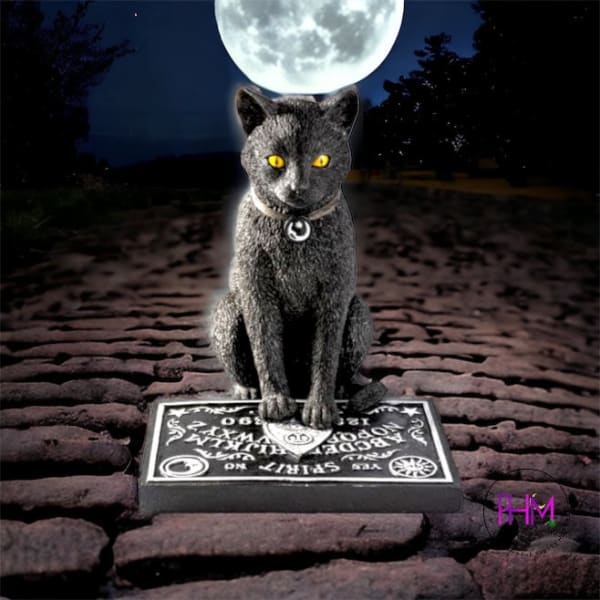

# Are you There?

This online trivia/board game represents a sppoky halloween take on trivia and board games. I want to challenge your knowledge of all things spooky and my favorite season of the year. I have built this game as a way to share that love and spread some knowledge about the holiday.

## MVP

There are 3 sections to this game. A true of false section, trivia section, and a riddle section. You will be timed during each section. A conpleted section will add more time to your next section. Game will not start until you click the start button. Use the planchette to answer all items.

## Technologies being used

HTML
CSS
JavaScript

## Next Steps

* Building a more robust game that will be multiplayer and more game sections to play based on specific stories as well as trivia and riddle sections.
* Building the rest of the game levels involved with the online escape room.
* Continuing to modernize the puzzle pages feature and props.

## Notes
sections will be ordered
What are the same components of every section.

- question then answwer 
- spirit board
- planchette
- timer 
- title
- background image

## code notes
element.append(node)
node can be a string or an HTMLElement, such as “
content
”, or document.createElement('div')